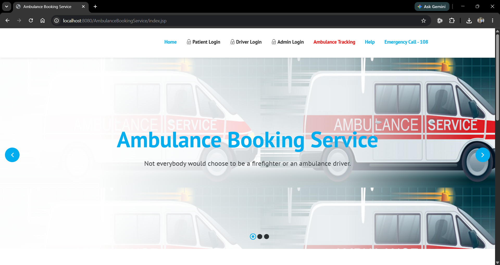
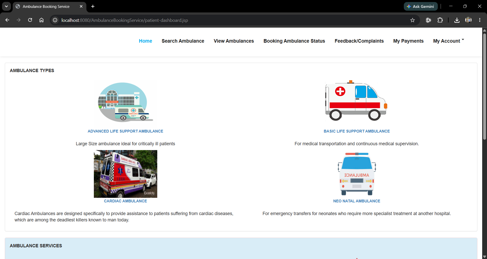
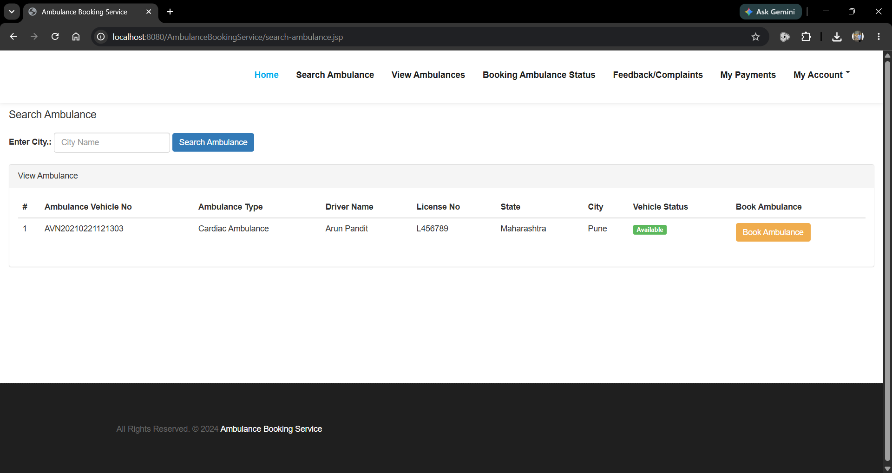
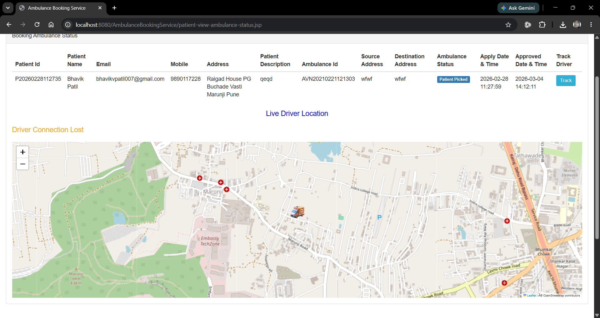
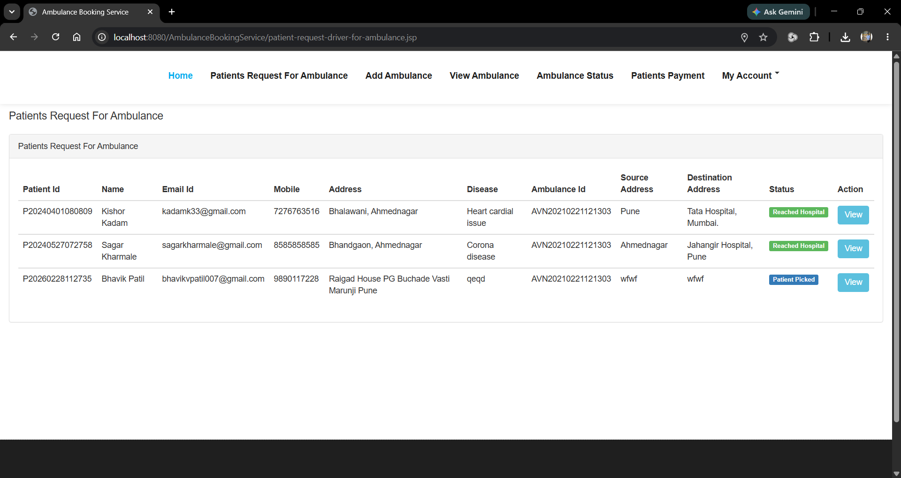
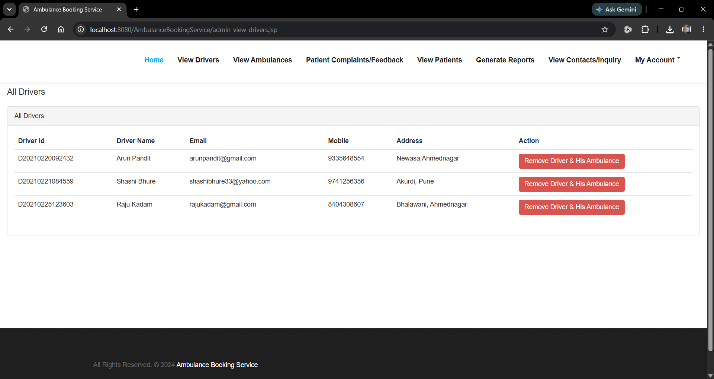
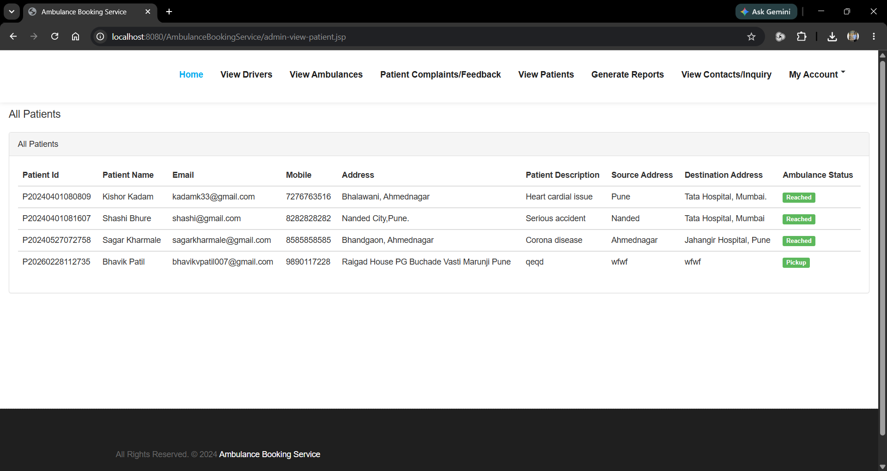
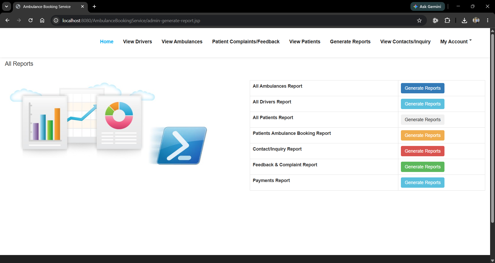

# 🚑 Ambulance Booking System


> A Java EE web application for ambulance booking, administration and real-time ambulance tracking.

## 📌 Highlights
- Three user roles: Patient, Driver, Administrator
- Ambulance booking & management
- Admin dashboard & reports
- SMTP email integration
- PDF invoice generation
- Real-time ambulance tracking using Browser Geolocation API, Leaflet.js and OpenStreetMap
- AJAX polling for live updates
- Driver online/offline detection
- Tracking history and last seen status

---


# 🎯 Objective

The objective of this project is to streamline ambulance booking and management through a centralized web application.

The system enables:
- Patients to book ambulances online and monitor booking status.
- Drivers to manage assigned bookings and share their live location.
- Administrators to manage patients, drivers, ambulances and reports efficiently.

The real-time ambulance tracking module improves transparency by allowing patients to monitor the ambulance's current location and estimated arrival progress.


# ⭐ My Contributions

This project was originally developed as an existing Java EE application. My work focused on significantly enhancing and extending the existing application rather than developing the complete Ambulance Booking System from scratch. My primary contribution was designing and implementing the complete Live Ambulance Tracking module, along with improvements to the backend, database schema, SMTP configuration, UI, documentation, and overall project structure.

Major contributions include:

- Designed and implemented the complete Live Ambulance Tracking module.
- Integrated Browser Geolocation API.
- Integrated Leaflet.js with OpenStreetMap.
- Developed AJAX-based real-time location updates.
- Implemented Driver Online/Offline detection.
- Added Driver Last Seen functionality.
- Added Driver Tracking History.
- Modified the MySQL database schema to support tracking.
- Fixed backend bugs and improved application stability.
- Enhanced UI pages and overall application flow.
- Configured SMTP email functionality.
- Replaced sensitive credentials with secure placeholders for public release.
- Prepared the project for GitHub with documentation, screenshots and SQL setup.

---

# 🏗️ Architecture

```text
+-------------+      HTTP       +-------------------------+
|   Browser   | <-------------> | JSP / Servlets          |
+-------------+                 +-----------+-------------+
                                            |
                                            v
                                     Business Logic
                                            |
                               +------------+------------+
                               | JDBC / MySQL Connector |
                               +------------+------------+
                                            |
                                            v
                                        MySQL Database

Patient / Driver Browser
        |
Geolocation API
        |
AJAX Polling
        |
Leaflet.js + OpenStreetMap
        |
Live Tracking Module
```

# 👥 User Roles

## Patient
- Registration
- Login
- Book Ambulance
- Track Ambulance
- Booking Status
- Payment Details
- Invoice
- Feedback
- Profile

## Driver
- Login
- Accept Booking
- Live Location
- Availability
- Profile

## Administrator
- Dashboard
- Manage Patients
- Manage Drivers
- Manage Ambulances
- Reports

# 🛰️ Live Tracking

Uses:

- Browser Geolocation API
- Leaflet.js
- OpenStreetMap
- AJAX Polling
- JDBC
- MySQL

Capabilities:

- Real-time ambulance tracking
- Driver online/offline detection
- Driver last seen
- Tracking history
- Public tracking page

# 💻 Technology Stack

| Layer | Technologies |
|-------|--------------|
| Backend | Java, JSP, Servlets, JDBC |
| Frontend | HTML, CSS, JavaScript, Bootstrap, jQuery |
| Database | MySQL |
| Server | Apache Tomcat |
| Libraries | Leaflet.js, Jakarta Mail, iText PDF, MySQL Connector/J |

# 🗄️ Database

The repository contains the complete MySQL database script required to run the application.

- The database schema is provided in `database/ambulancedb.sql`.
- Import this SQL file into MySQL before starting the project.
- Update your database connection details inside `DatabaseConnection.java` before deployment.

# 📸 Screenshot Gallery

| Home | Patient Dashboard |
|------|------|
|  |  |

| Booking | Tracking |
|------|------|
|  |  |

| Driver | Admin |
|------|------|
|  |  |

| View Patients | Reports |
|------|------|
|  |  |

# 📁 Repository Structure

```text
AmbulanceBookingService
│
├── src/
├── WebContent/
├── database/
│   └── ambulancedb.sql
├── docs/
│   └── screenshots/
│       ├── home-page.png
│       ├── patient-dashboard.png
│       ├── patient-ambulance-booking.png
│       ├── patient-ambulance-tracking.png
│       ├── driver-dashboard.png
│       ├── admin-dashboard.png
│       ├── admin-view-patients.png
│       └── admin-generate-reports.png
├── .settings/
├── .classpath
├── .project
├── .gitignore
└── README.md
```


### Directory Overview

| Directory | Description |
|-----------|-------------|
| `src/` | Java source code including Servlets and business logic. |
| `WebContent/` | JSP pages, CSS, JavaScript, images and web resources. |
| `database/` | Contains the MySQL database script. |
| `docs/screenshots/` | Contains screenshots used in the README. |

# 📋 Prerequisites

- Java JDK 17 or later
- Eclipse IDE
- Apache Tomcat 10
- MySQL 8.0+
- Git (optional)

# 🚀 Installation

1. Clone the repository.
2. Import the project into Eclipse.
3. Configure Apache Tomcat.
4. Import `database/ambulancedb.sql` into MySQL.
5. Configure database credentials in `DatabaseConnection.java`.
6. Configure SMTP placeholders inside `web.xml`.
7. Run the project on Tomcat.

# 🔒 Security Notice

SMTP email uses Gmail App Password authentication.

Before running the project, replace:

```text
<YOUR_EMAIL>
<YOUR_APP_PASSWORD>
```

inside `web.xml`.

**Never commit your Gmail address or Google App Password to GitHub.**

If credentials are accidentally exposed, revoke the Google App Password immediately and generate a new one.

# 🚀 Future Improvements

- Spring Boot
- Spring Security
- JWT Authentication
- REST APIs
- Docker
- Payment Gateway
- SMS Notifications
- Push Notifications
- Microservices

# 👤 Author

**Bhavik Patil**

GitHub: https://github.com/Bhavikvpatil007

LinkedIn: https://www.linkedin.com/in/bhavikvpatil007/

Repository:

https://github.com/Bhavikvpatil007/Ambulance-Booking-System

# 📄 License

This project is intended for educational and learning purposes.

Feel free to explore, learn from, and modify the project for educational use.
